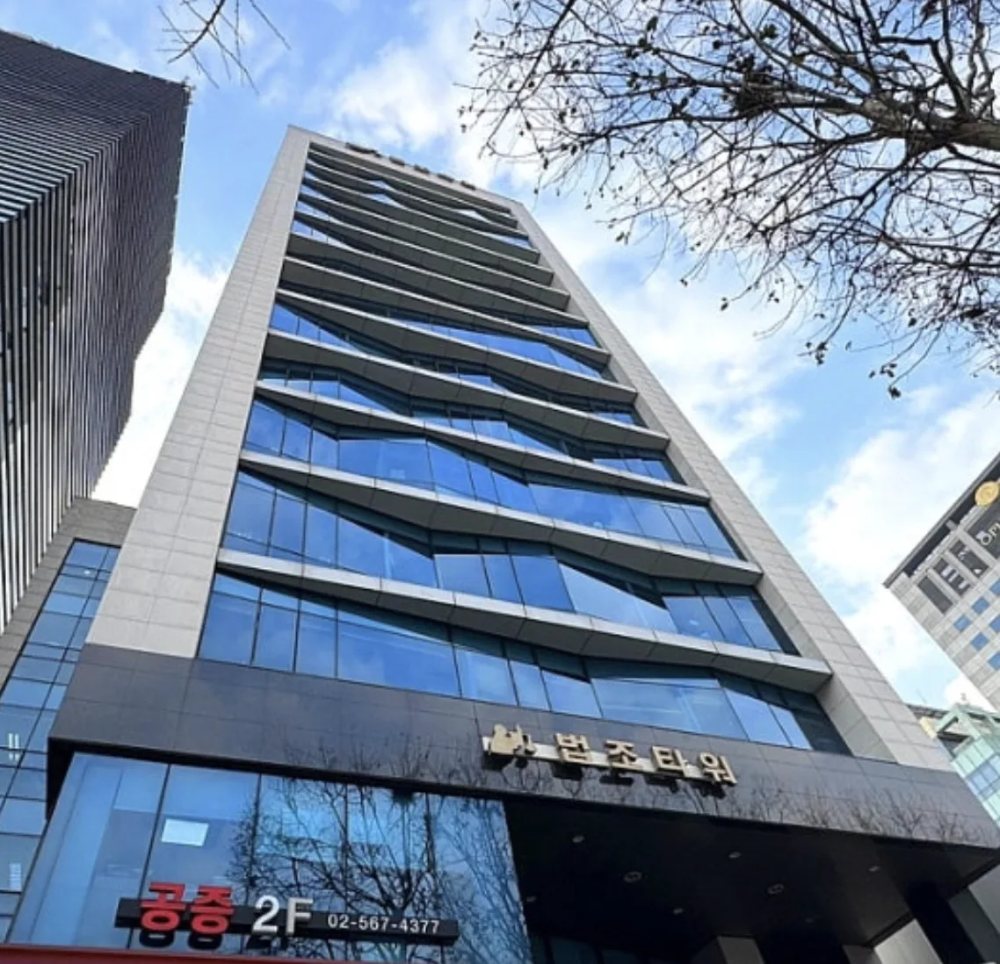

# 법무법인 유일 — LAW FIRM YUIL

정적 웹사이트(HTML · CSS · JavaScript). 빌드 도구 없이 파일 그대로 배포합니다.

```
index.html      마크업
style.css       스타일 (반응형)
main.js         질문 아코디언 · 업무분야 · 변호인단 · 폼
assets/         이미지(WebP) · SVG
netlify.toml    Netlify 캐시 · 보안 헤더 · 함수 · 리다이렉트
robots.txt
404.html        없는 페이지
netlify/        상담 접수 시 문자 발송 함수
docs/           설정 안내서
```

## 로컬에서 보기

```bash
npx http-server . -p 8080
# http://localhost:8080
```

## 배포

`claude/law-firm-website-recode-phtrgb` 에 푸시하면 Netlify가 자동 배포합니다.

---

## 디자인

**골드 베이지 · 여백 · 명조.** 색으로 권위를 만들지 않고 활자와 여백으로 만듭니다.

### 색 — 무채색 기본, 크림·골드는 아껴서

따뜻한 크림·베이지 바탕이 "너무 부드럽다"는 판단에 따라 노란기를 걷어냈습니다.
법무법인 이엘처럼 **무채색으로 무게를 잡고, 로고색은 어두운 구간에서만** 씁니다.

| 이름 | 값 | 쓰임 |
|---|---|---|
| `--paper` | `#fcfcfb` | 기본 바탕 (노란기 없는 오프화이트) |
| `--paper-2` | `#f1f1ef` | 섹션 교대용 중성 회색 |
| `--sand` | `#e6e6e3` | 인물 뒤 면 |
| `--ink` | `#17171a` | 본문 글자 |
| `--dark` | `#141416` | 어두운 구간 |
| `--cream` | `#e4d5b7` | 로고색 — **어두운 구간 전용** |
| `--gold` | `#8a7248` | eyebrow 등 아주 좁게만 |

**진한 브라운 + 골드는 쓰지 않습니다.** 2010년대 한국 법무법인 사이트의 전형이라
처음 만들었다가 촌스럽다는 평을 받은 조합입니다.

### 글꼴 — 모두 Google Fonts

| 용도 | 글꼴 |
|---|---|
| 한글 제목 | Noto Serif KR (명조) |
| 라틴 디스플레이 | Cormorant Garamond |
| 본문 | Noto Sans KR |

이전에 쓰던 Pretendard(jsDelivr)는 일부 망에서 차단되어 Google Fonts로 통일했습니다.

### 섹션

| # | 섹션 | 비고 |
|---|---|---|
| 1 | 히어로 | 배경 사진 + Y 로고가 그려지는 애니메이션 |
| 2 | 대표변호사 인사말 | 밝은 배경 + 컷아웃 인물 |
| 3 | 의뢰인의 질문 | 7문항 아코디언 |
| 4 | 업무분야 | 가로 아코디언 5칸 (모바일은 세로) |
| 5 | 변호인단 | 3열 그리드, 사진 위에 아무것도 안 덮음 |
| 6 | 원칙 | 어두운 구간 |
| 7 | 오시는 길 · 상담 | 지도 임베드 + 카카오/네이버 바로가기 |

별도 페이지: `privacy.html`(개인정보처리방침) · `thanks.html`(접수 완료)

---

## 첫 화면 사진 바꾸기

`index.html` 의 `.hero-bg` 한 줄만 바꾸면 됩니다.

```html

```

새 사진을 `assets/` 에 넣고 `src` 를 그 파일명으로 바꾸세요.
가로로 넓게 잘리므로 **가로 1600px 이상**을 권합니다.

### 동영상으로 바꾸려면

`.hero-bg` 를 통째로 아래로 교체합니다.

```html
<video class="hero-video" autoplay muted loop playsinline
       poster="assets/hero-building.webp">
  <source src="assets/hero.mp4" type="video/mp4">
</video>
```

`.hero-video` 스타일은 이미 준비돼 있습니다. 다만 세 가지를 유의하세요.

- **용량** — 5MB를 넘기지 마세요. 모바일에서 첫 화면이 늦게 뜹니다.
- **소리** — `muted` 가 없으면 브라우저가 자동재생을 막습니다.
- **모션 민감 사용자** — `prefers-reduced-motion` 설정을 켠 분에게는
  동영상 대신 `poster` 이미지가 보이도록 처리를 추가하셔야 합니다.

### 사진 저작권

`assets/hero-building.webp` 는 **직접 촬영하신 사무실 건물 사진**이라 문제가 없습니다.

인터넷에서 받은 사진을 쓰실 때는 상업적 이용이 허용되는지 반드시 확인하세요.
법인 홈페이지는 상업적 이용에 해당합니다. 무료로 쓸 수 있는 곳은
Unsplash, Pexels 등이 있습니다.

---

## ⚠️ 공개 전 반드시 확인할 것

### 1. 의뢰인 질문 7문항의 법률 내용 — 가장 중요

`main.js` 상단 `questions` 배열에 구속영장실질심사, 불송치 이의신청,
성범죄, 의료사고, 대여금 등 **법률 절차 설명이 들어 있습니다.**

이 문구는 일반적인 절차를 설명한 초안입니다.
**반드시 변호사가 직접 검토하고 수정하신 뒤 공개하세요.**
법 개정이나 실무 변화가 반영되지 않았을 수 있습니다.

특히 다음 항목은 재확인이 필요합니다.

- 불송치 이의신청 — **고발인의 이의신청권이 제외**된다고 썼습니다. 현행 조문 확인 필요
- 영장실질심사가 "청구 다음 날 열리는 것이 보통"이라는 서술
- 의료사고·대여금의 소멸시효 — 기간을 명시하지 않았으나 표현 검토 필요
- "착수 전에 서면으로 확인되지 않은 비용은 청구하지 않습니다" —
  **유일의 실제 수임 방침과 맞는지** 확인 필요

### 2. 6번째 변호사 — 자료 대기 중

여성 변호사 사진을 보내주셨으나 **제가 대화 속 이미지를 파일로 받을 수 없습니다.**
아래 순서로 올려주시면 반영하겠습니다.

1. 사진을 컴퓨터에 저장
2. 저장소 `assets/` 폴더 → `Add file` → `Upload files` → `lawyer-06.webp`(또는 png/jpg)로 업로드
3. **성명 · 직위 · 전문분야 · 경력**을 알려주세요

`main.js` 의 `attorneys` 배열에 항목 하나만 더하면 됩니다.
6명이 되면 변호인단은 3열 그리드가 두 줄로 딱 맞습니다.

### 3. 변호사 사진과 성명 — 확정됨

기존 홈페이지의 변호사 순서와 경력(기수 · 사법시험 회차)을 대조해 확정했습니다.

| 순서 | 성명 | 사진 | 대조 근거 |
|---|---|---|---|
| 1 | 정호길 대표변호사 | `lawyer-01-portrait.webp` | 25년차 · 제40회 · 연수원 30기 |
| 2 | 심상한 변호사 | `lawyer-02.webp` | 제49회 · 연수원 39기 · 노동위 공익위원 |
| 3 | 정주현 변호사 | `lawyer-03.webp` | 연수원 30기 · 중앙지법 조정위원 · 저서 |
| 4 | 김제도 변호사 | `lawyer-04.webp` | 연수원 47기 · 서울서부지검 검사 직무대리 |
| 5 | 이경숙 변호사 | `lawyer-05.webp` | 제50회 · 연수원 40기 · 가사법 전문분야 등록 |

`lawyer-01.webp`(전신 컷아웃)는 **인사말 섹션**에,
`lawyer-01-portrait.webp`(상반신 크롭)는 **변호인단 목록**에 씁니다.
전신 컷을 목록에 넣으면 얼굴이 작아 다른 분들과 크기가 맞지 않습니다.

### 4. 로고

`assets/logo-y.svg` 와 히어로·헤더·푸터의 Y 심볼은 **목업 사진을 보고 다시 그린 근사치**입니다.
원본 벡터 파일(`.ai` · `.svg`)이 있으시면 교체하는 편이 정확합니다.

### 5. 지도 — 실제 화면에서 확인해 주세요

API 키 없이 동작하는 Google Maps 임베드를 넣었습니다.
**제 작업 환경은 외부 접속이 막혀 있어 지도가 실제로 뜨는지 확인하지 못했습니다.**
배포된 사이트에서 직접 확인해 주세요.

지도가 안 뜨면 `index.html` 의 `.map` 안 `<iframe>` 을 지우고
카카오/네이버 바로가기 링크만 남기셔도 됩니다. 그 링크는 항상 동작합니다.

국내 이용자를 위해 바로가기 버튼을 함께 두었습니다.
**네이버지도는 법인이 알려준 실제 장소 링크(`https://naver.me/GALRcuul`)를 씁니다.**
장소 정보가 바뀌면 `index.html` 의 `.map-link-main` href 만 교체하시면 됩니다.

또한 `.map-note` 에 **가까운 지하철역과 주차 안내가 비어 있습니다.**
제가 추측으로 쓰지 않았으니 실제 정보로 채워주세요.

### 6. 상담 폼 — 연결했습니다

Netlify Forms 로 연결했습니다. **배포 후 첫 제출이 정상인지 한 번 시험해 주세요.**

- 접수함 위치 — Netlify 관리화면 → 해당 사이트 → **Forms** 탭 → `consult`
- 제출 후 `thanks.html` 로 이동합니다.
- `bot-field` 는 화면에 보이지 않는 스팸 덫입니다. 지우지 마세요.
- 폼 필드 이름은 `name` · `tel` · `message` · `agree` 입니다.

#### 알림 받기 — 안내서를 보세요

[`docs/상담알림-받는법.md`](docs/상담알림-받는법.md)

세 가지 방법을 비교하고 각각의 설정 순서를 적었습니다.

| | 비용 | 설정 |
|---|---|---|
| 이메일 | 무료 | 1분 — **먼저 이것부터 켜세요** |
| 문자(SMS) | 건당 약 20원 | 20분 — 코드는 이미 들어 있음 |
| 카카오 알림톡 | 심사 필요 | 권하지 않음 |

**구글 시트만으로는 알림이 오지 않습니다.** 시트의 알림 규칙은 사람이
직접 편집할 때만 작동하고, 스크립트가 넣은 줄에는 뜨지 않습니다.
시트는 장부로 쓰고 알림은 위 방법으로 따로 받으셔야 합니다.

#### 문자 발송 함수

`netlify/functions/submission-created.js` — 파일 이름 때문에 Netlify 가
폼 제출마다 자동으로 호출합니다. 별도 연결 설정이 필요 없습니다.

환경변수 `SOLAPI_KEY` · `SOLAPI_SECRET` · `SMS_FROM` · `SMS_TO` 를
Netlify 에 넣고 재배포하면 동작합니다. 넷 중 하나라도 없으면 조용히 건너뜁니다.

**상담 내용은 문자에 담지 않습니다.** 사건 내용이 통신망과 잠금화면 알림에
그대로 남기 때문입니다. 성명과 연락처만 보내고 내용은 관리화면에서 봅니다.

#### 구글 시트로 자동 적재하기

상담 내역을 표로 관리하고 싶으시면
[`docs/상담접수-구글시트-연동.md`](docs/상담접수-구글시트-연동.md) 를 따라 하세요.
Apps Script 코드와 단계별 안내가 들어 있습니다. 비용은 들지 않습니다.

연동을 마치시면 **개인정보처리방침의 위탁 항목에 Google 을 추가해야 합니다.**

#### 용량 제한

Netlify 무료 요금제는 **월 100건**까지 접수됩니다.
넘으면 그 달의 제출이 막히므로, 상담이 늘면 요금제 전환을 검토하셔야 합니다.

### 7. 변호사 광고규정

이번 페이지에는 승소율·사건 처리 건수 같은 수치가 **없습니다.**
다만 보내주신 자료에서 두 가지는 넣지 않았습니다. 넣으실 계획이라면 먼저 확인하세요.

- **무죄판결사건 목록** — 김제도 변호사 자료에 있던 무죄 사건 나열입니다.
  성공사례 광고에 해당할 수 있어 넣지 않았습니다.
- **"전문변호사" 표기** — 대한변협 전문분야 등록을 마친 경우에만 쓸 수 있습니다.
  등록이 확인된 이경숙 변호사(가사법)만 "전문분야 등록"으로 적었고,
  나머지는 중립적으로 "주요 분야"처럼 표기했습니다.
  다른 분들도 등록이 되어 있다면 `main.js` 의 `field` 를 바꾸셔도 됩니다.

### 8. 남은 자리표시자

기존 홈페이지에서 가져와 아래는 **실제 값으로 채웠습니다.**

| 항목 | 값 |
|---|---|
| 주소 | 서울특별시 서초구 서초대로 264, 2층 (서초동, 법조타워) |
| 대표전화 · 공증상담 | 02-567-4377 |
| 교통 · 형사 상담 | 02-597-4977 |
| 팩스 | 02-583-5222 |
| 공증팩스 | 02-563-8181 |
| 이메일 | psg8656@naver.com |
| 사업자등록번호 | 120-86-64302 |

아직 확인이 필요한 것은 다음과 같습니다.

- **상담시간** 평일 09:00–18:00 — 실제 운영시간과 맞는지
- 지도 — 자리표시자

### 9. 검색엔진 — 차단을 풀었습니다

실제 연락처가 들어갔으므로 색인을 허용했습니다.

- `robots.txt` → `Allow: /`
- `<meta name="robots">` → `index, follow`

---

## 내용 수정하기

`main.js` 상단 세 배열에서 관리합니다.

```js
const questions = [
  { tag: "형사", q: "질문", a: ["문단1", "문단2"] },
];

const practices = [
  { name: "형사", en: "CRIMINAL", image: "assets/center-criminal.webp",
    desc: "...", tags: ["구속영장", "압수수색"] },
];

const attorneys = [
  { name: "정호길", role: "대표변호사", field: "형사 · 수사 및 재판 대응",
    image: "assets/lawyer-01.webp", career: ["25년 경력 형사전문"] },
];
```

- 질문은 개수 제한이 없습니다. 번호는 자동으로 매겨집니다.
- 업무분야 이름은 **두 글자**로 맞추세요. 길면 닫힌 칸에서 잘립니다.
- 히어로 문구와 인사말, 원칙 3항목은 `index.html` 에 직접 적혀 있습니다.

## 이미지 다시 만들기

```bash
pip install Pillow
python3 - <<'EOF'
from PIL import Image
import os
SRC = "원본폴더"
for f in os.listdir(SRC):
    if not f.endswith(".png"): continue
    im = Image.open(os.path.join(SRC, f)).convert("RGB")
    if im.width > 1600:
        im = im.resize((1600, round(im.height * 1600 / im.width)), Image.LANCZOS)
    im.save("assets/" + f[:-4] + ".webp", "WEBP", quality=82, method=6)
EOF
```

## 검증 결과

| 항목 | 결과 |
|---|---|
| 뷰포트 7종(360~1440px) 가로 넘침 | 0건 |
| 로드 시 스크롤 튐 | 없음 |
| JS 에러 | 0건 |

## 참고 — 반복해서 걸렸던 것들

- 한글 명조 제목은 `line-height` 를 **1.3 아래로 내리지 않습니다.** 획이 겹칩니다.
- `<br>` 을 모바일에서 숨길 때는 **`<br>` 앞에 공백을 둡니다.** 그러지 않으면
  단어가 붙어 "기록 속 놓친 단서와진술의 모순" 처럼 보입니다.
- 그리드에서 **일부 자식만 위치를 지정하면 나머지가 엉뚱한 칸으로 밀립니다.**
  `.q-head` 에서 이 문제로 가로 넘침이 났습니다. 셋 다 `grid-area` 로 못박습니다.
- `max-width` 에 `ch` 단위를 쓰면 한글에서 너무 좁아집니다. `px` 을 씁니다.
- 인물 사진은 **세로 비율**입니다. 좁은 화면에서 가로로 눕히면 눈높이 한 줄만 남습니다.
- `img` 의 `height` 속성은 CSS `aspect-ratio` 를 **눌러버립니다.** 둘을 같이 쓰려면
  CSS 에 `height: auto` 를 반드시 넣습니다. 이걸 빠뜨려 모바일에서 변호사 사진이
  124x998 로 늘어났습니다.
- `assets/lawyer-01.webp` 는 배경을 지운 **컷아웃**이라 `object-fit` 은 `contain` 입니다.
- **Playwright 의 `fullPage` · 요소 촬영은 레이아웃을 왜곡합니다.** 화면 밖까지 담으려고
  뷰포트를 늘리기 때문에, flex 비율이 실제와 다르게 찍힙니다. 폭이 이상해 보이면
  사진을 믿지 말고 `getBoundingClientRect()` 로 재보세요.
  (업무분야 패널이 잘려 보였지만 실제로는 441 / 170px 로 정상이었습니다.)
- 지연 로딩(`loading="lazy"`) 이미지는 화면에 들어온 적이 없으면 촬영에서 빈칸으로 나옵니다.
  깨진 것이 아니니 스크롤을 먼저 태우고 확인하세요.
- 히어로가 어두운 사진이므로 **헤더 글자는 밝게 시작**해야 합니다.
  스크롤해 히어로를 지나면 `.is-stuck` 이 붙어 어두운 글자로 바뀝니다.
